# ⚡ 快速部署指南

本指南介紹如何使用 GitHub Actions CI/CD 實現快速部署，將部署時間從 **~10 分鐘縮短到 ~30 秒**！

## 📊 性能對比

| 方法 | 構建位置 | 部署時間 | 優點 | 缺點 |
|------|---------|---------|------|------|
| **舊方式** | 服務器 | ~10 分鐘 | 簡單 | 極慢、佔用服務器資源 |
| **新方式（CI/CD）** | GitHub Actions | ~30 秒 | 超快、自動化 | 需要配置 |

## 🚀 快速開始

### 步驟 1: 配置 GitHub Secrets

在你的 GitHub 倉庫設置以下 Secrets：

1. 進入 **Settings** → **Secrets and variables** → **Actions**
2. 添加以下 Secrets：

```
SERVER_HOST=152.42.204.18          # 你的服務器 IP
SERVER_USER=root                    # SSH 用戶名
SSH_PRIVATE_KEY=<你的 SSH 私鑰>    # 完整的私鑰內容
```

#### 如何獲取 SSH 私鑰？

```bash
# 在本地執行
cat ~/.ssh/id_rsa

# 複製整個輸出（包括 BEGIN 和 END 行）
```

### 步驟 2: 啟用 GitHub Container Registry

GitHub Container Registry (GHCR) 是免費的，無需額外配置！

1. 確保倉庫是 **public** 或你有 **packages:write** 權限
2. GitHub Actions 會自動使用 `GITHUB_TOKEN` 推送映像

### 步驟 3: 服務器端準備

首次部署需要在服務器上執行：

```bash
# SSH 連接到服務器
ssh root@152.42.204.18

# 進入專案目錄
cd /opt/heart-whisper-town

# 拉取最新代碼（包含新的部署配置）
git pull origin production

# 賦予執行權限
chmod +x quick-deploy.sh

# 登入 GitHub Container Registry（一次性）
echo YOUR_GITHUB_TOKEN | docker login ghcr.io -u YOUR_GITHUB_USERNAME --password-stdin
```

**如何獲取 GitHub Token？**

1. 前往 https://github.com/settings/tokens
2. 點擊 **Generate new token (classic)**
3. 勾選 `read:packages` 權限
4. 複製生成的 token

### 步驟 4: 自動化部署流程

現在，每次你推送代碼到 `production` 分支：

```bash
# 本地開發
git add .
git commit -m "你的更改"
git push origin production
```

**GitHub Actions 會自動：**

1. ✅ 在 GitHub 上構建 Docker 映像（~3-5 分鐘）
2. ✅ 推送映像到 GHCR
3. ✅ SSH 到服務器
4. ✅ 拉取最新映像（~10 秒）
5. ✅ 重啟服務（~20 秒）

**總耗時：服務器端只需 ~30 秒！** 🎉

## 🔧 手動快速部署

如果你想手動觸發部署：

```bash
# SSH 到服務器
ssh root@152.42.204.18

# 執行快速部署腳本
cd /opt/heart-whisper-town
sudo ./quick-deploy.sh
```

這會：
- 拉取最新的預構建映像（不需要重新構建！）
- 重啟服務
- 完成時間：~30 秒

## 📋 完整工作流程

### 開發流程

```mermaid
graph LR
    A[本地開發] --> B[推送到 production]
    B --> C[GitHub Actions 構建]
    C --> D[推送映像到 GHCR]
    D --> E[SSH 部署到服務器]
    E --> F[服務器拉取映像]
    F --> G[重啟服務]
    G --> H[部署完成 ✅]
```



### 構建優化

**Docker 層快取策略：**

```dockerfile
# ✅ 好的做法（快取友好）
COPY package*.json ./      # 第一層：依賴文件
RUN npm install             # 第二層：安裝（會被快取）
COPY . .                    # 第三層：源代碼
RUN npm run build          # 第四層：構建

# ❌ 不好的做法
COPY . .                    # 複製所有文件
RUN npm install             # 每次都重新安裝
RUN npm run build          # 每次都重新構建
```

## 🎯 進階優化

### 1. 使用 BuildKit 加速構建

在服務器上啟用 BuildKit：

```bash
# 編輯 /etc/docker/daemon.json
{
  "features": {
    "buildkit": true
  }
}

# 重啟 Docker
systemctl restart docker
```

### 2. 多階段構建並行化

GitHub Actions 已經配置了並行構建：

```yaml
# 前端和後端同時構建
- name: Build Backend (並行)
- name: Build Frontend (並行)
```

### 3. Registry 快取

使用 GHCR 的快取層：

```yaml
cache-from: type=registry,ref=ghcr.io/.../backend:buildcache
cache-to: type=registry,ref=ghcr.io/.../backend:buildcache,mode=max
```

## 📊 監控部署狀態

### 在 GitHub 上查看

1. 進入倉庫的 **Actions** 標籤
2. 查看最新的 workflow 運行
3. 實時查看構建日誌

### 在服務器上查看

```bash
# 查看服務狀態
docker-compose -f docker-compose.production-prebuilt.yml ps

# 查看日誌
docker-compose -f docker-compose.production-prebuilt.yml logs -f

# 只查看後端日誌
docker-compose -f docker-compose.production-prebuilt.yml logs -f backend

# 健康檢查
curl http://localhost/health
```

## 🐛 故障排查

### 問題 1: GitHub Actions 構建失敗

**檢查：**
```bash
# 本地測試構建
docker build -t test-backend ./backend
docker build -t test-frontend ./frontend
```

### 問題 2: 服務器拉取映像失敗

**解決：**
```bash
# 重新登入 GHCR
docker logout ghcr.io
echo YOUR_TOKEN | docker login ghcr.io -u YOUR_USERNAME --password-stdin

# 手動拉取測試
docker pull ghcr.io/nrps9909/tahrd-graduation-project/backend:latest
```

### 問題 3: 服務啟動失敗

**檢查：**
```bash
# 查看詳細日誌
docker-compose -f docker-compose.production-prebuilt.yml logs

# 檢查環境變數
cat .env.production

# 測試健康檢查
curl -v http://localhost:4000/health
```

## 💡 最佳實踐

### 1. 使用標籤版本

```bash
# 在 GitHub Actions 中使用 commit SHA 標籤
ghcr.io/user/repo/backend:abc123
ghcr.io/user/repo/backend:latest
```

### 2. 保留舊映像以便回滾

```bash
# 回滾到特定版本
docker-compose -f docker-compose.production-prebuilt.yml down
export IMAGE_TAG=abc123  # 舊的 commit SHA
docker-compose -f docker-compose.production-prebuilt.yml up -d
```

### 3. 定期清理

```bash
# 清理舊映像
docker image prune -a -f

# 清理舊容器
docker container prune -f

# 查看磁盤使用
docker system df
```

## 🔐 安全性

### 保護 Secrets

- ❌ 不要在代碼中硬編碼 token
- ✅ 使用 GitHub Secrets
- ✅ 定期輪換 SSH 密鑰
- ✅ 使用最小權限原則

### GHCR 訪問控制

```bash
# 設置倉庫為 private（可選）
# 前往 Settings → Visibility → Change visibility

# 設置 package 權限
# 前往 package 設置 → Manage Actions access
```

## 📈 成本分析

| 項目 | 成本 |
|------|------|
| GitHub Actions | 免費（public repo）|
| GHCR 存儲 | 免費（500MB + 1GB 流量/月）|
| 服務器帶寬 | 拉取映像（~1GB/次）|

**結論：** 幾乎零額外成本，但性能提升巨大！

## 🎓 相關資源

- [GitHub Actions 文檔](https://docs.github.com/en/actions)
- [GHCR 文檔](https://docs.github.com/en/packages)
- [Docker BuildKit](https://docs.docker.com/build/buildkit/)
- [Docker 多階段構建](https://docs.docker.com/build/building/multi-stage/)

---

**有問題？** 查看 GitHub Actions 的運行日誌或在 Issues 中提問。

