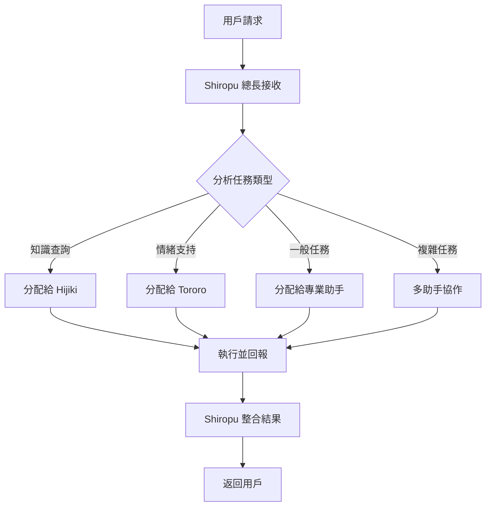

# 🌸 心語小鎮 - 完整功能說明

> 詳細介紹心語小鎮的所有功能與技術實作

## 目錄

- [核心系統](#核心系統)
- [AI 助手系統](#ai-助手系統)
- [知識管理系統](#知識管理系統)
- [3D 互動世界](#3d-互動世界)
- [對話系統](#對話系統)
- [技術特性](#技術特性)

---

## 核心系統

### 🤖 多助手協作架構

心語小鎮採用分層的 AI 助手架構，每個助手都有獨特的職責：

#### 總長層 (Chief)
- **呂貝熙 (Shiropu)** 🐱
  - 團隊決策與任務分配
  - 協調各助手之間的工作
  - 優先級評估與資源調度
  - 衝突解決與仲裁

#### 執行層 (Specialist Agents)

**白噗噗 (Hijiki)** 🐰 - 知識管理專家
```typescript
// 核心功能
- RAG (Retrieval-Augmented Generation) 知識檢索
- 向量化記憶存儲與相似度搜尋
- 自動摘要與標籤生成
- 知識圖譜建構與關聯分析
```

**Tororo** 🌸 - 情緒療癒師
```typescript
// 核心功能
- 同理心對話與情緒支持
- 心理健康檢測
- 療癒建議生成
- 長期陪伴追蹤
```

**其他專業助手** 📚
- 任務執行助手
- 數據分析助手
- 創意設計助手
- 技術支援助手

### 🎯 任務分配流程



---

## AI 助手系統

### 🧠 人格系統

每個助手都有精心設計的人格設定：

#### 呂貝熙 (Shiropu) 人格特質
```yaml
性格:
  - 沉穩冷靜
  - 理性決策
  - 高度負責
  - 偶爾嚴肅但關心夥伴

語言風格:
  - 簡潔明確
  - 使用專業術語
  - 偶爾幽默緩和氣氛

特殊習慣:
  - 喜歡用「喵」結尾（但不頻繁）
  - 會用「嗯...」思考
```

#### 白噗噗 (Hijiki) 人格特質
```yaml
性格:
  - 聰明好學
  - 細心謹慎
  - 樂於分享知識
  - 有點書呆子氣息

語言風格:
  - 詳細解釋
  - 舉例說明
  - 引用資料來源

特殊習慣:
  - 會說「找到了！」
  - 整理資訊時會用條列式
```

#### Tororo 人格特質
```yaml
性格:
  - 溫暖體貼
  - 敏感細膩
  - 正向鼓勵
  - 柔軟堅定

語言風格:
  - 溫柔親切
  - 情緒共鳴
  - 正面引導

特殊習慣:
  - 常用「❤️」「🌸」等溫暖符號
  - 會說「我懂你的感受」
```

### 🔗 記憶與成長系統

#### 短期記憶 (Session Memory)
```typescript
interface SessionMemory {
  sessionId: string
  startTime: Date
  messages: Message[]
  context: ConversationContext
  emotions: EmotionTrack[]
}
```
- 單次對話內容
- 當前情緒狀態
- 臨時上下文資訊
- 即時情緒追蹤

#### 長期記憶 (Persistent Memory)
```typescript
interface LongTermMemory {
  id: string
  userId: string
  assistantId: string
  content: string
  summary: string
  tags: string[]
  importance: number // 1-10
  emotionalTone: EmotionalTone
  relatedMemories: string[] // 相關記憶 ID
  accessCount: number
  lastAccessedAt: Date
  createdAt: Date
}
```
- 重要對話片段
- 用戶偏好與習慣
- 情緒歷史記錄
- 關係發展軌跡

#### 記憶檢索策略
```typescript
// 向量相似度搜尋
async function retrieveRelevantMemories(
  query: string,
  limit: number = 5
): Promise<Memory[]> {
  // 1. 將查詢轉換為向量
  const queryVector = await vectorize(query)

  // 2. 在向量資料庫中搜尋
  const similarMemories = await vectorDB.search({
    vector: queryVector,
    limit: limit * 2, // 取更多候選
    threshold: 0.7 // 相似度閾值
  })

  // 3. 結合重要性與時間衰減
  const scoredMemories = similarMemories.map(mem => ({
    ...mem,
    finalScore: calculateMemoryScore(mem)
  }))

  // 4. 返回最相關的記憶
  return scoredMemories
    .sort((a, b) => b.finalScore - a.finalScore)
    .slice(0, limit)
}

function calculateMemoryScore(memory: Memory): number {
  const similarityScore = memory.similarity * 0.4
  const importanceScore = (memory.importance / 10) * 0.3
  const recencyScore = getRecencyScore(memory.createdAt) * 0.2
  const accessScore = Math.min(memory.accessCount / 10, 1) * 0.1

  return similarityScore + importanceScore + recencyScore + accessScore
}
```

---

## 知識管理系統

### 📚 核心功能

#### 1. 智能記憶創建

**自動分析管線**
```typescript
async function createMemory(rawContent: string) {
  // Step 1: AI 分析原始內容
  const analysis = await analyzeContent(rawContent)

  // Step 2: 生成摘要
  const summary = await generateSummary(rawContent)

  // Step 3: 提取關鍵點
  const keyPoints = await extractKeyPoints(rawContent)

  // Step 4: 自動標籤
  const tags = await generateTags(rawContent, analysis)

  // Step 5: 評估重要性
  const importance = calculateImportance({
    emotionalIntensity: analysis.emotions,
    contentNovelty: analysis.novelty,
    userEngagement: analysis.engagement
  })

  // Step 6: 關聯分析
  const relatedMemories = await findRelatedMemories(summary, tags)

  return {
    rawContent,
    summary,
    keyPoints,
    tags,
    importance,
    relatedMemories,
    ...analysis
  }
}
```

**重要性評分算法**
```typescript
function calculateImportance(factors: AnalysisFactors): number {
  const emotionalWeight = factors.emotionalIntensity * 0.4
  const noveltyWeight = factors.contentNovelty * 0.3
  const engagementWeight = factors.userEngagement * 0.2
  const lengthWeight = Math.min(factors.contentLength / 1000, 1) * 0.1

  const rawScore = emotionalWeight + noveltyWeight + engagementWeight + lengthWeight

  // 正規化到 1-10 範圍
  return Math.max(1, Math.min(10, Math.ceil(rawScore * 10)))
}
```

#### 2. 知識檢索 (RAG)

**RAG 實作流程**
```typescript
async function ragQuery(userQuestion: string): Promise<string> {
  // Step 1: 檢索相關記憶
  const relevantMemories = await retrieveRelevantMemories(userQuestion)

  // Step 2: 建構增強提示詞
  const enhancedPrompt = buildRAGPrompt({
    question: userQuestion,
    context: relevantMemories,
    systemInstructions: HIJIKI_PERSONALITY
  })

  // Step 3: 生成回應
  const response = await gemini.generateContent(enhancedPrompt)

  // Step 4: 引用來源
  const responseWithCitations = addCitations(response, relevantMemories)

  return responseWithCitations
}

function buildRAGPrompt(data: RAGData): string {
  return `
你是白噗噗 (Hijiki)，知識管理專家。

**相關記憶：**
${data.context.map((mem, i) => `
[記憶 ${i + 1}] (${mem.createdAt.toLocaleDateString()})
${mem.summary}
標籤：${mem.tags.join(', ')}
`).join('\n---\n')}

**用戶問題：**
${data.question}

**回答指引：**
1. 根據相關記憶提供準確答案
2. 明確引用記憶來源（使用 [記憶 X] 格式）
3. 如果記憶不足，誠實說明
4. 用你獨特的風格回答（有點書呆子氣但很可愛）
  `
}
```

#### 3. 知識庫介面功能

**視圖模式**
- **Grid 視圖** 📱
  - 卡片式展示
  - 適合視覺瀏覽
  - 顯示 emoji、標題、預覽

- **List 視圖** 📋
  - 列表式展示
  - 適合快速掃描
  - 顯示更多詳細資訊

**篩選與排序**
```typescript
// 分類篩選
type CategoryFilter = 'all' | 'hijiki' | 'tororo' | 'shiropu' | ...

// 排序選項
type SortOption =
  | 'recent'      // 最新優先
  | 'importance'  // 重要性降序
  | 'alphabetical' // 字母順序

// 進階篩選
interface AdvancedFilters {
  showArchived: boolean
  dateRange?: { start: Date; end: Date }
  minImportance?: number
  tags?: string[]
}
```

**批次操作**
- ✅ 釘選/取消釘選
- ✅ 封存/還原
- ✅ 批次刪除
- ✅ 批次修改標籤
- ✅ 匯出 (JSON/CSV)

#### 4. 記憶詳情頁面

**資訊區塊** (條件顯示)
```typescript
// 只在有內容時才顯示以下區塊：

1. 📝 內容
   - 完整原始內容或摘要

2. 🏷️ 標籤
   - 所有相關標籤
   - 可編輯新增/刪除

3. ✨ 重點摘錄
   - AI 提取的關鍵點

4. 📎 附件
   - 圖片、文件等

5. 🔗 相關連結
   - 外部參考連結

6. 🤖 AI 分析
   - 情緒分析
   - 主題分類
   - 相關建議

7. 🔗 相關記憶
   - 內容相似的其他記憶
   - 可點擊跳轉
```

---

## 3D 互動世界

### 🏝️ 島嶼系統

#### 島嶼結構
```typescript
interface Island {
  id: string
  name: string
  assistantId: string
  position: Vector3
  terrain: TerrainConfig
  decorations: Decoration[]
  npc: NPCConfig
  interactionZones: InteractionZone[]
}
```

#### 地形生成
```typescript
// 使用 Simplex Noise 生成自然地形
function generateTerrain(config: TerrainConfig): Mesh {
  const geometry = new PlaneGeometry(
    config.size,
    config.size,
    config.segments,
    config.segments
  )

  const vertices = geometry.attributes.position.array
  const simplex = new SimplexNoise()

  // 多層噪聲疊加
  for (let i = 0; i < vertices.length; i += 3) {
    const x = vertices[i]
    const z = vertices[i + 2]

    // 基礎地形
    let height = simplex.noise2D(x * 0.1, z * 0.1) * 2

    // 細節層
    height += simplex.noise2D(x * 0.3, z * 0.3) * 0.5

    // 微細節
    height += simplex.noise2D(x * 0.8, z * 0.8) * 0.2

    vertices[i + 1] = height
  }

  geometry.computeVertexNormals()
  return new Mesh(geometry, terrainMaterial)
}
```

#### 島嶼裝飾
```yaml
裝飾類型:
  - 樹木與植物:
      - 櫻花樹
      - 楓樹
      - 小草叢
      - 花朵

  - 建築物:
      - NPC 小屋
      - 商店
      - 裝飾小屋

  - 互動物件:
      - 公告板
      - 釣魚點
      - 收集點

  - 環境效果:
      - 粒子效果
      - 光源
      - 音效觸發點
```

### 🎨 視覺效果

#### 後處理效果
```typescript
// 使用 @react-three/postprocessing
import { EffectComposer, Bloom, SSAO, Vignette } from '@react-three/postprocessing'

<EffectComposer>
  {/* 泛光效果 - 柔和的發光 */}
  <Bloom
    intensity={0.3}
    luminanceThreshold={0.9}
    luminanceSmoothing={0.9}
  />

  {/* 環境光遮蔽 - 增加深度感 */}
  <SSAO
    samples={31}
    radius={0.05}
    intensity={30}
  />

  {/* 暈影效果 - 聚焦中心 */}
  <Vignette
    offset={0.3}
    darkness={0.5}
  />
</EffectComposer>
```

#### 光照系統
```typescript
// 動態天空照明
function SkyLighting({ time }: { time: number }) {
  const sunPosition = calculateSunPosition(time)
  const sunColor = getSunColor(time)
  const ambientIntensity = getAmbientIntensity(time)

  return <>
    <directionalLight
      position={sunPosition}
      color={sunColor}
      intensity={1.5}
      castShadow
      shadow-mapSize={[2048, 2048]}
    />
    <ambientLight intensity={ambientIntensity} />
    <hemisphereLight
      skyColor="#87CEEB"
      groundColor="#8B7355"
      intensity={0.3}
    />
  </>
}
```

### 🐱 Live2D 角色系統

#### 模型載入
```typescript
import { Live2DModel } from 'pixi-live2d-display'

async function loadNPCModel(modelPath: string): Promise<Live2DModel> {
  const model = await Live2DModel.from(modelPath)

  // 設定表情
  model.internalModel.motionManager.expressionManager =
    new ExpressionManager(model.internalModel.settings)

  // 設定動作
  model.internalModel.motionManager.groups = {
    idle: await loadMotions('idle'),
    tap: await loadMotions('tap'),
    greeting: await loadMotions('greeting')
  }

  return model
}
```

#### 表情與動作
```typescript
// 表情系統
enum Expression {
  NORMAL = 'normal',
  HAPPY = 'happy',
  SAD = 'sad',
  SURPRISED = 'surprised',
  THINKING = 'thinking'
}

// 根據對話情緒自動切換表情
function updateExpression(emotionalTone: string) {
  const expressionMap: Record<string, Expression> = {
    'positive': Expression.HAPPY,
    'negative': Expression.SAD,
    'questioning': Expression.THINKING,
    'excited': Expression.SURPRISED,
  }

  const expression = expressionMap[emotionalTone] || Expression.NORMAL
  npcModel.expression(expression)
}

// 動作觸發
function playMotion(motionName: string) {
  npcModel.motion(motionName, 0, MotionPriority.NORMAL)
}
```

---

## 對話系統

### 💬 聊天介面

#### 訊息類型
```typescript
interface Message {
  id: string
  role: 'user' | 'assistant'
  content: string
  timestamp: Date
  metadata?: {
    assistantId?: string
    emotionalTone?: string
    relatedMemories?: string[]
    actionButtons?: ActionButton[]
  }
}
```

#### 氣泡樣式
```typescript
// 根據助手自訂顏色
const assistantColors: Record<string, string> = {
  'shiropu': 'from-purple-400 to-pink-400',
  'hijiki': 'from-blue-400 to-cyan-400',
  'tororo': 'from-pink-300 to-rose-400',
}

function ChatBubble({ message }: { message: Message }) {
  const isUser = message.role === 'user'
  const gradient = isUser
    ? 'from-gray-200 to-gray-300'
    : assistantColors[message.metadata?.assistantId || 'default']

  return (
    <div className={`
      px-4 py-3 rounded-2xl max-w-[70%]
      bg-gradient-to-br ${gradient}
      ${isUser ? 'ml-auto' : 'mr-auto'}
    `}>
      {message.content}
    </div>
  )
}
```

#### 即時打字效果
```typescript
function TypewriterText({ text }: { text: string }) {
  const [displayText, setDisplayText] = useState('')
  const [currentIndex, setCurrentIndex] = useState(0)

  useEffect(() => {
    if (currentIndex < text.length) {
      const timeout = setTimeout(() => {
        setDisplayText(prev => prev + text[currentIndex])
        setCurrentIndex(prev => prev + 1)
      }, 30) // 每個字 30ms

      return () => clearTimeout(timeout)
    }
  }, [currentIndex, text])

  return <span>{displayText}</span>
}
```

### 🎭 對話情境感知

#### 上下文管理
```typescript
interface ConversationContext {
  sessionId: string
  topic: string
  userIntent: Intent
  emotionalState: EmotionalState
  mentionedEntities: Entity[]
  previousTopics: string[]
  conversationFlow: ConversationFlowState
}

async function analyzeContext(
  messages: Message[]
): Promise<ConversationContext> {
  const lastMessages = messages.slice(-10) // 最近10條

  return {
    topic: await extractTopic(lastMessages),
    userIntent: await classifyIntent(lastMessages),
    emotionalState: await detectEmotion(lastMessages),
    mentionedEntities: await extractEntities(lastMessages),
    previousTopics: await trackTopics(messages),
    conversationFlow: determineFlowState(lastMessages)
  }
}
```

#### 多輪對話狀態機
```typescript
enum ConversationFlowState {
  GREETING = 'greeting',
  TOPIC_INTRODUCTION = 'topic_introduction',
  DEEP_DISCUSSION = 'deep_discussion',
  CLARIFICATION = 'clarification',
  WRAPPING_UP = 'wrapping_up',
  FAREWELL = 'farewell'
}

function determineFlowState(messages: Message[]): ConversationFlowState {
  if (messages.length <= 2) return ConversationFlowState.GREETING

  const recentIntent = messages[messages.length - 1].metadata?.intent

  if (recentIntent === 'question') {
    return ConversationFlowState.CLARIFICATION
  } else if (recentIntent === 'goodbye') {
    return ConversationFlowState.WRAPPING_UP
  }

  // 更多邏輯...
  return ConversationFlowState.DEEP_DISCUSSION
}
```

---

## 技術特性

### ⚡ 性能優化

#### 1. GraphQL 查詢優化
```typescript
// 使用 DataLoader 防止 N+1 查詢
import DataLoader from 'dataloader'

const assistantLoader = new DataLoader(async (assistantIds: string[]) => {
  const assistants = await prisma.assistant.findMany({
    where: { id: { in: assistantIds } }
  })

  // 維持順序
  return assistantIds.map(id =>
    assistants.find(a => a.id === id)
  )
})

// Resolver 中使用
const resolvers = {
  Memory: {
    assistant: (parent) => assistantLoader.load(parent.assistantId)
  }
}
```

#### 2. 前端性能優化
```typescript
// 虛擬滾動 - 只渲染可見項目
import { useVirtualizer } from '@tanstack/react-virtual'

function MemoryList({ memories }: { memories: Memory[] }) {
  const parentRef = useRef<HTMLDivElement>(null)

  const virtualizer = useVirtualizer({
    count: memories.length,
    getScrollElement: () => parentRef.current,
    estimateSize: () => 200, // 估計每項高度
    overscan: 5 // 多渲染 5 項緩衝
  })

  return (
    <div ref={parentRef} className="h-screen overflow-auto">
      <div style={{ height: virtualizer.getTotalSize() }}>
        {virtualizer.getVirtualItems().map((virtualRow) => (
          <div
            key={virtualRow.index}
            style={{
              position: 'absolute',
              top: 0,
              left: 0,
              width: '100%',
              height: virtualRow.size,
              transform: `translateY(${virtualRow.start}px)`
            }}
          >
            <MemoryCard memory={memories[virtualRow.index]} />
          </div>
        ))}
      </div>
    </div>
  )
}
```

#### 3. AI 回應快取
```typescript
import { LRUCache } from 'lru-cache'

// LRU 快取，最多 1000 項，30 分鐘過期
const responseCache = new LRUCache<string, string>({
  max: 1000,
  ttl: 1000 * 60 * 30
})

async function getCachedAIResponse(
  prompt: string
): Promise<string> {
  const cacheKey = hashPrompt(prompt)

  // 檢查快取
  const cached = responseCache.get(cacheKey)
  if (cached) return cached

  // 生成新回應
  const response = await gemini.generateContent(prompt)

  // 存入快取
  responseCache.set(cacheKey, response)

  return response
}
```

### 🔐 安全性

#### 1. 輸入驗證與清理
```typescript
import DOMPurify from 'isomorphic-dompurify'
import { z } from 'zod'

// Zod schema 驗證
const CreateMemorySchema = z.object({
  content: z.string()
    .min(1, '內容不能為空')
    .max(5000, '內容不能超過 5000 字'),
  tags: z.array(z.string()).max(10, '標籤不能超過 10 個'),
  emoji: z.string().emoji('必須是有效的 emoji').optional()
})

// 清理 HTML
function sanitizeInput(rawInput: string): string {
  return DOMPurify.sanitize(rawInput, {
    ALLOWED_TAGS: [], // 不允許任何 HTML 標籤
    ALLOWED_ATTR: []
  })
}
```

#### 2. API Rate Limiting
```typescript
import rateLimit from 'express-rate-limit'

const limiter = rateLimit({
  windowMs: 15 * 60 * 1000, // 15 分鐘
  max: 100, // 最多 100 個請求
  message: '請求過於頻繁，請稍後再試',
  standardHeaders: true,
  legacyHeaders: false,
})

app.use('/api/', limiter)
```

#### 3. 環境變數保護
```typescript
// 從不在代碼中硬編碼 API Key
const GEMINI_API_KEY = process.env.GEMINI_API_KEY

if (!GEMINI_API_KEY) {
  throw new Error('GEMINI_API_KEY is required')
}

// 使用時總是檢查
function initializeGemini() {
  if (!GEMINI_API_KEY) {
    throw new Error('Gemini API key not configured')
  }

  return new GoogleGenerativeAI(GEMINI_API_KEY)
}
```

### 📊 監控與日誌

#### 請求追蹤
```typescript
// Winston 日誌配置
import winston from 'winston'

const logger = winston.createLogger({
  level: 'info',
  format: winston.format.json(),
  defaultMeta: { service: 'heart-whisper-town' },
  transports: [
    new winston.transports.File({
      filename: 'logs/error.log',
      level: 'error'
    }),
    new winston.transports.File({
      filename: 'logs/combined.log'
    })
  ]
})

// Gemini API 呼叫追蹤
async function trackGeminiCall(
  operation: string,
  fn: () => Promise<any>
) {
  const startTime = Date.now()
  const logFile = `logs/gemini-tracking/${Date.now()}_${operation}.json`

  try {
    const result = await fn()
    const duration = Date.now() - startTime

    await fs.writeFile(logFile, JSON.stringify({
      operation,
      duration,
      success: true,
      timestamp: new Date().toISOString()
    }, null, 2))

    return result
  } catch (error) {
    const duration = Date.now() - startTime

    await fs.writeFile(logFile, JSON.stringify({
      operation,
      duration,
      success: false,
      error: error.message,
      timestamp: new Date().toISOString()
    }, null, 2))

    throw error
  }
}
```

---

## 🎮 使用情境範例

### 情境 1：知識查詢

```
用戶: "我上週跟你說過什麼關於工作的事？"

系統流程:
1. Shiropu 接收請求
2. 判斷為知識查詢，分配給 Hijiki
3. Hijiki 執行 RAG 檢索:
   - 向量化查詢: "工作相關的記憶 + 上週時間範圍"
   - 檢索相關記憶 (相似度 > 0.7)
   - 依重要性與時間排序
4. Hijiki 整合記憶並回答:
   "找到了！上週你提到了這些工作相關的事：

   [記憶 1] (3 天前) 你說工作壓力有點大，準備要跟主管談談...
   [記憶 2] (5 天前) 你完成了一個重要專案，感到很有成就感...

   要我幫你更詳細回顧嗎？ 🐰"
```

### 情境 2：情緒支持

```
用戶: "我今天心情不太好..."

系統流程:
1. Shiropu 接收請求
2. 偵測到情緒需求，分配給 Tororo
3. Tororo 分析情緒:
   - 檢測負面情緒信號
   - 查詢用戶歷史情緒模式
   - 找出可能的觸發因素
4. Tororo 提供溫暖回應:
   "聽起來你今天過得不太順利呢... 我在這裡陪著你 🌸

   想跟我說說發生什麼事嗎？或者我們也可以聊點輕鬆的，
   讓你休息一下 ❤️"

5. 根據用戶回應繼續深入對話
```

### 情境 3：複雜任務協作

```
用戶: "幫我整理最近一個月的工作心得，並給我一些建議"

系統流程:
1. Shiropu 分析任務:
   - 需要知識檢索 (Hijiki)
   - 需要分析與建議 (多助手協作)

2. 分配子任務:
   - Hijiki: 檢索一個月內的工作相關記憶
   - 分析助手: 分析工作模式與情緒趨勢
   - Tororo: 提供心理健康建議

3. Shiropu 整合結果:
   "我們團隊一起為你整理了最近一個月的工作情況：

   📊 Hijiki 的統計:
   - 記錄了 15 條工作相關記憶
   - 3 次重大成就，7 次挑戰，5 次學習心得

   📈 工作模式分析:
   - 你在每週二和週四效率最高
   - 下午 2-4 點是你的黃金時段

   💡 Tororo 的建議:
   - 注意到你週五經常感到疲憊，建議調整節奏...
   - 記得給自己慶祝小成就的時間 🌸"
```

---

## 🔮 未來規劃

### 即將推出
- [ ] 多語言支援 (英文、日文)
- [ ] 語音對話功能
- [ ] 記憶匯出與備份
- [ ] 自訂助手外觀
- [ ] 移動端 App

### 長期規劃
- [ ] 社群功能（多人小鎮）
- [ ] 記憶分享機制
- [ ] 更多 NPC 角色
- [ ] 小遊戲與互動活動
- [ ] AR 擴增實境體驗

---

## 📚 技術棧總覽

### 前端
- **React 18** - UI 框架
- **TypeScript** - 類型安全
- **Three.js + React Three Fiber** - 3D 渲染
- **Tailwind CSS** - 樣式設計
- **Zustand** - 狀態管理
- **Apollo Client** - GraphQL 客戶端
- **Framer Motion** - 動畫
- **Pixi.js + Live2D** - 2D 角色動畫

### 後端
- **Node.js + Express** - 伺服器
- **TypeScript** - 類型安全
- **Apollo Server** - GraphQL API
- **Prisma** - ORM
- **PostgreSQL** - 主資料庫
- **Redis** - 快取
- **Socket.IO** - WebSocket
- **Winston** - 日誌

### AI & ML
- **Google Gemini 2.0** - LLM
- **pgvector** - 向量資料庫擴展
- **Sentence Transformers** - 文字向量化

### DevOps
- **Docker** - 容器化
- **GitHub Actions** - CI/CD
- **Nginx** - 反向代理

---

**💖 感謝閱讀！歡迎探索心語小鎮的溫暖世界**
